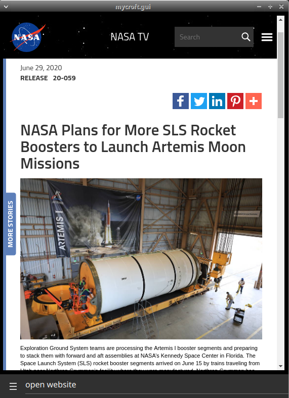

#  Space News

## About

All the latest news about Space!

Sources:
- [Space News](https://spacenews.com/)
- [ESA RSS feeds](http://www.esa.int/Services/RSS_Feeds)
- [NASA RSS feeds](https://www.nasa.gov/content/nasa-rss-feeds)
- [spaceflight-news-api](https://spaceflightnewsapi.net/)
- [hubble site feeds](http://hubblesite.org/api/documentation#external_feed)

Can be used as idle screen for the mark2

## Examples
* "news about space"
* "more news"
* "space news from 15 days ago"
* "open website"

## TODO
* websettings

## Credits
- JarbasAi
- [Space News](https://spacenews.com/)
- [ESA RSS feeds](http://www.esa.int/Services/RSS_Feeds)
- [NASA RSS feeds](https://www.nasa.gov/content/nasa-rss-feeds)
- [spaceflight-news-api](https://spaceflightnewsapi.net/)
- [hubble site feeds](http://hubblesite.org/api/documentation#external_feed)

## Category
**Information**

## Tags
#nasa #space #news #gui
